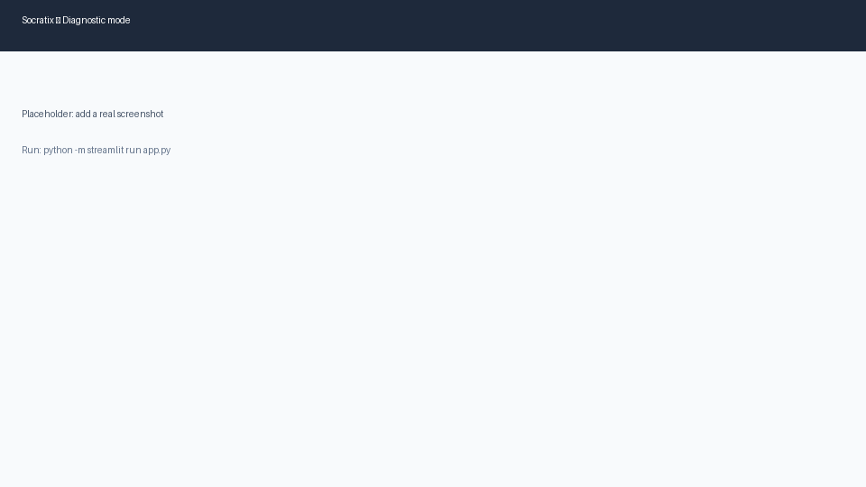
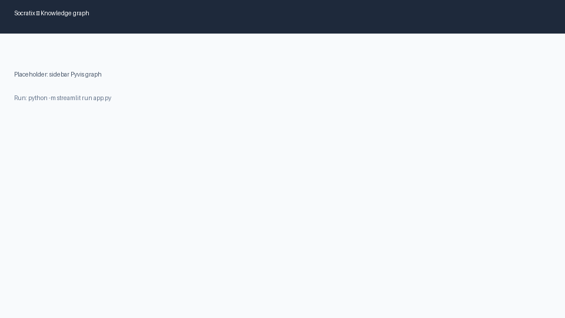

# Socratix

**Socratix** is an adaptive AI tutoring agent that diagnoses what you know through Socratic dialogue, builds a personal knowledge graph of your understanding, and teaches only the specific concepts you are missing — not a generic lecture from page one.

**Zero paid APIs.** Everything runs locally on your laptop: the LLM (Ollama), embeddings (sentence-transformers), vector store (ChromaDB), graph (NetworkX), and UI (Streamlit).

---

## How Socratix differs from a generic chatbot tutor

| Generic chatbot tutor | Socratix |
|----------------------|----------|
| Flat chat history | **Personal knowledge graph** — 50 Python concepts with prerequisite edges, color-coded per student |
| Explains everything in order | **Gap analysis** — topological sort finds the minimum teaching path to your target topic |
| One-size-fits-all corrections | **Misconception database** — ChromaDB retrieves targeted corrections for detected wrong beliefs |
| Abstract explanations | **Analogies from what you already know** — teaching uses concepts you confirmed as `known` |

---

## Tech stack (100% free & open-source)

| Layer | Tool | Role |
|-------|------|------|
| LLM | [Ollama](https://ollama.com) + Llama 3.1 8B | Socratic questions, classification, teaching prose |
| Knowledge graph | [NetworkX](https://networkx.org) | 50-node DAG of Python fundamentals |
| Vector store | [ChromaDB](https://www.trychroma.com) (local persistent) | Misconception → correction retrieval |
| Embeddings | [sentence-transformers](https://www.sbert.net) (`all-MiniLM-L6-v2`) | Local semantic search, no API key |
| Progress | SQLite | Cross-session student state |
| UI | [Streamlit](https://streamlit.io) | Chat + live Pyvis graph sidebar |
| Visualization | [Pyvis](https://pyvis.readthedocs.io) | Interactive HTML knowledge graph |

No OpenAI, no Anthropic, no cloud accounts. Model weights download via Ollama and Hugging Face on first run.

---

## Quick start

### 1. Prerequisites

- **Python 3.10+** (tested on 3.14)
- **Ollama** — [https://ollama.com/download](https://ollama.com/download)

### 2. Install Ollama and pull the model

Open the Ollama desktop app (it starts the local server), or run:

```powershell
ollama serve
ollama pull llama3.1:8b
```

If 8B is too slow on your CPU, use Mistral 7B instead:

```powershell
ollama pull mistral:7b
$env:OLLAMA_MODEL = "mistral:7b"
```

### 3. Install Python dependencies

```powershell
cd D:\Socratix
python -m venv .venv
.venv\Scripts\activate
pip install -r requirements.txt
```

### 4. Verify Ollama

```powershell
python scripts/test_phase2.py
```

Expected: `Phase 2 looks good.`

### 5. Launch the app

```powershell
python -m streamlit run app.py
```

Or double-click **`run.bat`** (same command; works when `streamlit` is not on PATH).

Open **http://localhost:8501** → enter a student ID → choose a target topic → **Start session**.

**Ollama check:** If the daemon is down, the sidebar shows a red error and **Start session** is disabled. With the desktop app open, you usually do not need extra permissions.

---

## Screenshots

Replace these placeholders with your own captures after running the app.

| Diagnostic mode | Knowledge graph sidebar | Teaching after misconception |
|-----------------|-------------------------|------------------------------|
|  |  |  |

---

## Project structure

```
Socratix/
├── app.py                      # Streamlit entry point
├── run.bat                     # Windows launcher (python -m streamlit)
├── data/
│   ├── concepts.json           # 50 editable concept nodes + prerequisites
│   └── misconceptions.json     # 20 seed misconceptions + corrections
├── socratix/
│   ├── concept_graph.py        # NetworkX graph load/build/validate
│   ├── visualize.py            # Pyvis HTML export
│   ├── llm.py                  # Ollama wrapper (ask_llm)
│   ├── prompts.py              # All LLM system prompts (tune here)
│   ├── diagnostic.py           # Socratic questioning + classification
│   ├── student_model.py        # JSON profile + graph sync
│   ├── gap_analyzer.py         # Minimum teaching path
│   ├── misconceptions.py       # ChromaDB retrieval
│   ├── teaching_agent.py       # Explanations + understanding checks
│   └── persistence.py          # SQLite schema + save/load
├── scripts/
│   ├── test_phase1.py … test_phase8.py
│   └── test_phase7.py --quick  # offline teaching logic check
├── docs/                       # Screenshot placeholders
├── PROJECT_PLAN.md             # Full build handoff / architecture notes
└── requirements.txt
```

Generated at runtime (gitignored): `socratix.sqlite`, `chroma_db/`, `student_profiles/`, `output/`.

---

## Phase tests

Run these in order to verify each layer:

```powershell
python scripts/test_phase1.py    # Concept graph + Pyvis HTML
python scripts/test_phase2.py    # Ollama connection (requires ollama pull)
python scripts/test_phase3.py    # Diagnostic agent (requires Ollama)
python scripts/test_phase4.py    # Student profile JSON
python scripts/test_phase5.py    # Gap analyzer
python scripts/test_phase6.py    # ChromaDB misconceptions (~80 MB model first run)
python scripts/test_phase7.py --quick   # Teaching agent logic (no LLM)
python scripts/test_phase7.py           # Teaching agent live (slow)
python scripts/test_phase8.py    # SQLite persistence
python -m streamlit run app.py   # Full UI (Phase 9)
```

---

## Configuration

| Variable | Default | Purpose |
|----------|---------|---------|
| `OLLAMA_BASE_URL` | `http://localhost:11434` | Ollama API URL |
| `OLLAMA_MODEL` | `llama3.1:8b` | Model tag for all LLM calls |

---

## Limitations

- **Local 8B model quality** — Llama 3.1 8B is weaker than frontier models at strict JSON and nuanced classification. Prompts in `socratix/prompts.py` include retry fallbacks; tune there if classifications drift.
- **Single domain** — Python fundamentals through basic data structures (50 concepts in `data/concepts.json`). Edit that file to extend the curriculum.
- **Misconception coverage** — 20 seed entries in `data/misconceptions.json`. Re-run `build_misconception_db()` or Phase 6 test after adding more.
- **Streamlit + SQLite** — The app stores the DB connection in `st.session_state` with `check_same_thread=False` so reruns do not hit threading errors.

---

## License

MIT License — see [LICENSE](LICENSE).

Model weights are **not** shipped with this repo. Ollama and sentence-transformers download models to your machine on first use.

---

## Acknowledgments

Built as a portfolio project demonstrating adaptive tutoring with a fully local, open-source stack.
